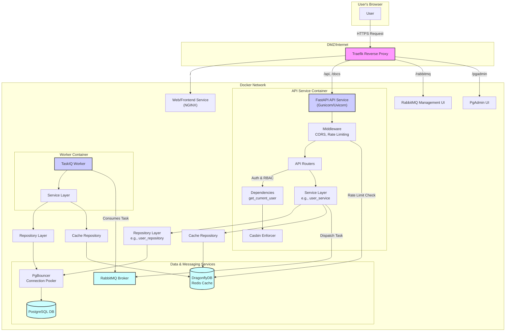
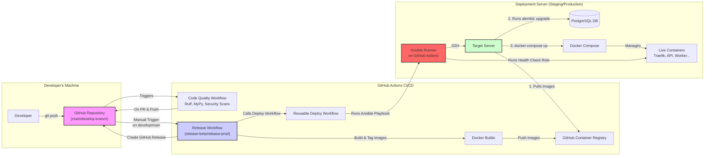

# FastAPI Base Project

[](https://www.google.com/search?q=./.github/workflows)
[](https://www.google.com/search?q=./ansible)
[](https://www.google.com/search?q=./docker-compose.prod.yml)
[](https://www.google.com/search?q=./ruff.toml)
[](https://opensource.org/licenses/MIT)

A comprehensive, production-ready boilerplate for FastAPI applications, built with a focus on modern development practices, scalability, and maintainability. This project provides a solid foundation for building robust RESTful APIs, incorporating a full suite of tools for authentication, authorization, asynchronous tasks, CI/CD, and automated deployment.

---

## ✨ Features

This project comes packed with features designed for enterprise-grade applications:

- **Modern API Framework**: Built with **FastAPI** for high performance and automatic interactive documentation.
- **Authentication**: Complete token-based authentication flow (access and refresh tokens) using JWT, with secure cookie support. Includes password recovery and user management flows.
- **Authorization**: Fine-grained, Role-Based Access Control (RBAC) powered by **Casbin**, with policies managed via a REST API.
- **Asynchronous Task Queue**: Integrated with **Taskiq** and **RabbitMQ** for handling background tasks and scheduled jobs efficiently.
- **Database**: Uses **PostgreSQL** with **SQLAlchemy 2.0** for the ORM layer and **Alembic** for handling database migrations.
- **Database Connection Pooling**: **PgBouncer** is pre-configured to manage database connections efficiently, crucial for high-traffic applications.
- **Caching**: Leverages an in-memory data store (**DragonflyDB**, compatible with Redis) for caching and rate limiting.
- **Containerized Environment**: Fully containerized with **Docker** and **Docker Compose** for consistent development, staging, and production environments.
- **Reverse Proxy & Load Balancing**: Uses **Traefik** as a modern reverse proxy that automatically discovers services and handles routing, including path-based routing for the API, RabbitMQ dashboard, and PgAdmin.
- **Robust CI/CD Pipeline**: Automated workflows using **GitHub Actions** for:
  - Code quality checks (linting, formatting, type checking) with Ruff and MyPy.
  - Security scanning for secrets and vulnerabilities (TruffleHog, CodeQL).
  - Automated building and pushing of Docker images to GitHub Container Registry.
  - Automated beta and production releases with release drafting.
- **Automated Deployment**: Sophisticated deployment automation using **Ansible**:
  - Support for multiple environments (staging, production).
  - Zero-downtime deployment strategy with automated backups.
  - Health checks post-deployment to ensure application stability.
  - One-command rollback to the previous stable version in case of failure.
- **Configuration Management**: Centralized and environment-specific configuration using YAML files and `.env` files.
- **Developer Experience**:
  - `pre-commit` hooks to ensure code quality before commits.
  - `Makefile` for common development tasks like database migrations.
  - Comprehensive logging configured with **Loguru**.
  - **Sentry** integration for real-time error monitoring.

## 🏗️ Architecture

The project is designed with a scalable and decoupled architecture, separating concerns to ensure maintainability and performance.

### Runtime Architecture

This diagram illustrates the flow of a user request through the live system, from the browser to the database and back.



### CI/CD & Deployment Architecture

This diagram shows the automated workflow from code commit to a live deployment on a server.



## 🚀 Technology Stack

| Component             | Technology                                                                                                      |
| --------------------- | --------------------------------------------------------------------------------------------------------------- |
| **Backend**           | [Python 3.10](https://www.python.org/), [FastAPI](https://fastapi.tiangolo.com/)                                |
| **Database**          | [PostgreSQL 15](https://www.postgresql.org/)                                                                    |
| **Migrations**        | [Alembic](https://alembic.sqlalchemy.org/)                                                                      |
| **Connection Pooler** | [PgBouncer](https://www.pgbouncer.org/)                                                                         |
| **Caching/Locking**   | [DragonflyDB](https://www.dragonflydb.io/) (Redis compatible)                                                   |
| **Message Broker**    | [RabbitMQ](https://www.rabbitmq.com/)                                                                           |
| **Async Tasks**       | [Taskiq](https://taskiq-python.github.io/)                                                                      |
| **Containerization**  | [Docker](https://www.docker.com/), [Docker Compose](https://docs.docker.com/compose/)                           |
| **Reverse Proxy**     | [Traefik](https://traefik.io/traefik/)                                                                          |
| **CI/CD**             | [GitHub Actions](https://github.com/features/actions)                                                           |
| **Deployment**        | [Ansible](https://www.ansible.com/)                                                                             |
| **Code Quality**      | [Ruff](https://github.com/astral-sh/ruff), [MyPy](http://mypy-lang.org/), [pre-commit](https://pre-commit.com/) |
| **Error Monitoring**  | [Sentry](https://sentry.io/)                                                                                    |

## 🏗️ Project Structure

The repository is organized into distinct directories, each with a specific purpose:

```
.
├── .github/              # GitHub Actions workflows and reusable actions
├── ansible/              # Ansible playbooks, roles, and templates for deployment
├── api/                  # The core FastAPI application source code
│   ├── app/              # Main application package
│   │   ├── core/         # Core components (auth, db, cache, settings)
│   │   ├── src/          # Business logic modules (users, items, etc.)
│   │   ├── tasks/        # Asynchronous task definitions
│   │   └── ...
│   ├── Dockerfile.dev    # Dockerfile for development
│   └── Dockerfile.prod   # Dockerfile for production
├── pgadmin/              # Configuration for PgAdmin
├── pgbouncer/            # Configuration for PgBouncer
├── postgres/             # PostgreSQL initialization scripts
├── scripts/              # Utility scripts for the project
├── .env.example          # Example environment variables file
├── docker-compose.dev.yml # Docker Compose for local development
├── docker-compose.prod.yml# Docker Compose for production
├── Makefile              # Makefile for common development commands
└── pyproject.toml        # Project dependencies and tool configuration
```

## 🏁 Getting Started

Follow these steps to get the project running locally for development.

### Prerequisites

- **Docker**: [Install Docker](https://docs.docker.com/get-docker/)
- **Docker Compose**: [Install Docker Compose](https://docs.docker.com/compose/install/) (usually included with Docker Desktop)

### Installation & Setup

1.  **Clone the repository:**

    ```bash
    git clone <your-repository-url>
    cd <repository-name>
    ```

2.  **Create the environment file:**
    Copy the example environment file and fill in the required values.

    ```bash
    cp .env.example .env
    ```

    You will need to set values for `POSTGRES__PASSWORD`, `RABBITMQ__PASS`, `PGADMIN__PASSWORD`, etc., in the `.env` file.

3.  **Build and run the services using Docker Compose:**
    This command will build the Docker images and start all the services defined in `docker-compose.dev.yml` in detached mode.

    ```bash
    make up
    ```

    Alternatively, you can run `docker-compose -f docker-compose.dev.yml up -d --build`.

4.  **Run database migrations:**
    The first time you start the application, you need to apply the database migrations. The `prestart.sh` script handles this automatically. If you need to run them manually or create a new migration:

    ```bash
    # Apply latest migrations
    make migrate

    # Create a new migration file after changing models
    make migration msg="Your migration message"
    ```

### Accessing the Services

- **API**: `http://localhost:11112` (as per `APP__API_PORT` in `.env.example`)
- **API Docs (Swagger)**: `http://localhost:11112/docs`
- **API Docs (ReDoc)**: `http://localhost:11112/redoc`
- **PgAdmin**: `http://localhost:5050`
- **RabbitMQ Management**: Mapped via Traefik. Check `docker-compose.dev.yml` for the path rule (`/rabbitmq`) on the proxy port.

### Default Admin User

Upon first startup, the application automatically creates a default administrator user with the following credentials (configured in `api/app/configs/config.yml`):

- **Email**: `admin@gmail.com`
- **Username**: `admin`
- **Password**: `admin_password`

**⚠️ Security Note**: For production deployments, make sure to:

1. Change the default admin password immediately after first login
2. Update the `USER.FIRST_USER_*` values in your configuration files
3. Consider disabling open registration by setting `USER.OPEN_REGISTRATION: false`

You can use these credentials to:

- Access the API authentication endpoints
- Test the API using the interactive documentation at `/docs`
- Manage user roles and permissions through the RBAC system

## ⚙️ Configuration

Application configuration is managed through environment variables, which are loaded from a `.env` file. Refer to `.env.example` for the full list of available variables.

### Key Environment Variables (`.env.example`)

- **`COMPOSE_PROJECT_NAME`**: A unique name for the Docker Compose project.
- **`APP__VERSION`**: The version of the application.
- **`APP__PORT`**: The external port for the Traefik proxy to listen on.
- **`APP__API_PORT`**: The external port mapped to the FastAPI application for local development.
- **`POSTGRES__*`**: Credentials and connection details for the PostgreSQL database.
- **`RABBITMQ__*`**: Credentials for the RabbitMQ message broker.
- **`PGADMIN__*`**: Credentials for the PgAdmin web interface.
- **`SENTRY__DSN`**: (Optional) DSN for Sentry error tracking.

## 🔄 CI/CD & Deployment

This project implements a robust CI/CD pipeline using GitHub Actions and Ansible, enabling automated testing, releases, and deployments.

### Git Flow

- **`develop`**: The primary development branch. All feature branches are merged here.
- **`main`**: The production branch. It should only contain stable, released code.

### GitHub Actions Workflows

- `code-quality.yml`: Runs on every push and pull request to `develop` and `main`. It performs:
  - Linting and code style checks.
  - Static type checking.
  - Security analysis with TruffleHog and CodeQL.
- `release-beta.yml`:
  - **Trigger**: Manual dispatch on the `develop` branch.
  - **Action**: Builds `api` and `web` Docker images, tags them with a beta version (e.g., `v1.2.3-beta.1`), pushes them to GitHub Container Registry, creates a pre-release on GitHub, and automatically deploys to the **staging** environment.
- `release-production.yml`:
  - **Trigger**: Manual dispatch on the `main` branch.
  - **Action**: Builds `api` and `web` Docker images, tags them with a stable version (e.g., `v1.2.3`), pushes them to GHCR, creates a full release on GitHub, and automatically deploys to the **production** environment.
- `deploy-to-server.yml`:
  - A reusable workflow that executes the Ansible deployment playbook. It handles setting up SSH, creating the Ansible inventory, and running the deployment with the correct environment variables and secrets.

### Ansible Deployment

The `ansible/` directory contains the automation for deploying the application to servers.

- **Zero-Downtime**: The `deploy.yml` playbook is designed for zero-downtime deployments. It first creates a backup of the current configuration, pulls the new images, and then restarts the services using Docker Compose.
- **Health Checks**: After a deployment, the `health_check` role verifies that all services are running and healthy before completing the workflow.
- **Rollback**: If a deployment fails (or is triggered manually), the `rollback.yml` playbook can be executed. It finds the latest backup, restores the previous `.env` and `docker-compose.yml` files, and redeploys the last known good version.
- **Multi-Environment**: The deployment system is designed to handle multiple environments (e.g., `staging`, `production`) using separate inventory and variable files (`inventory/` and `group_vars/`).

For detailed usage, refer to the [Ansible README](https://www.google.com/search?q=./ansible/README.md).

## 🤝 Contributing

Contributions are welcome\! Please follow these guidelines:

1.  **Code Style**: This project uses **Ruff** for formatting and linting. Please ensure your code adheres to the style guide.
2.  **Pre-Commit Hooks**: The project is configured with `pre-commit` to automatically check and format your code before you commit.
    - Install `pre-commit`: `pip install pre-commit`
    - Set up the hooks: `pre-commit install`
    - Now, `pre-commit` will run automatically on `git commit`.

## 📄 License

This project is licensed under the MIT License.
