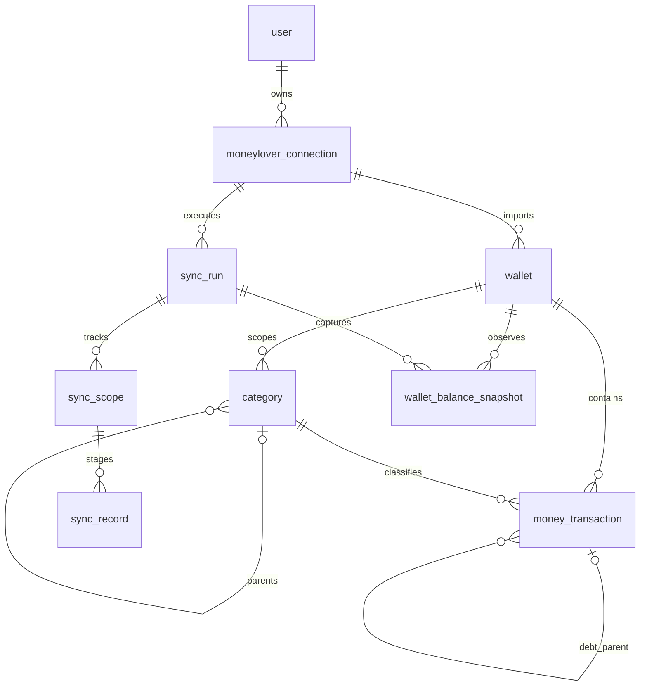

# CashLens database design: Money Lover synchronization and dashboards

Status: proposed design, based on the checked-in samples. No models or migrations are implemented by this document.

## 1. Scope and recommendation

Build a **read-only local mirror of Money Lover**, with normalized PostgreSQL tables for reporting and retained JSONB source records for troubleshooting and reprocessing. Money Lover remains the source of truth; CashLens handles ingestion, filtering, and dashboards. Synchronization is one-way, not bidirectional editing.

Keep the existing `user` table for CashLens authentication and ownership. Add connection/sync tracking, wallets, wallet-scoped categories, transactions, and observed wallet balances. **Do not create a second financial ledger for debts**: debts and repayments belong in the transaction table. Do not repurpose `item` into a financial model.

For this personal app, ordinary PostgreSQL queries and indexes are enough initially. Defer double-entry accounting, a warehouse, partitioning, exchange-rate conversion, budgets, and materialized aggregates until needed.

## 2. Source inspection

Inspected locally; no authenticated requests were made. These files are examples, not a complete API specification or a coherent full-history snapshot.

| File / endpoint | Response shape | Observed contents |
| --- | --- | --- |
| `docs/moneylover/list-wallet.json`, `/api/wallet/list` | `data[]` | 8 wallets; all `currency_id=4`, balances keyed by `VND`; all active/not deleted; 5 excluded from total |
| `docs/moneylover/list-category.json`, `/api/category/list-all` | `data[]` | 711 rows, **145 distinct `_id` values**, 711 distinct `(account, _id)` pairs; 463 rows have a parent |
| `docs/moneylover/list-transaction.json`, `/api/transaction/list` | `data.daterange`, `data.transactions[]` | 20 transactions for one wallet, September 1–4, 2026; 2 outgoing transfers |
| `docs/moneylover/list-debts.json`, `/api/transaction/debts` | `data[]` | 461 transactions dated January 31, 2021–August 31, 2026; 275 have a transaction `parent` |

All examples have `error=0`; validate this application-level status in addition to HTTP status. The README shows POST requests; transactions take `walletId`, `startDate`, `endDate`, and debts take an `accounts` array. It does not establish pagination, limits, deletion feeds, incremental cursors, rate limits, or authentication renewal behavior.

### 2.1 Wallets

- `_id` is the remote wallet identifier; transaction `account._id` references it.
- Fields include `name`, `owner`, `currency_id`, `sortIndex`, `account_type`, `icon`, `archived`, `exclude_total`, `isDelete`, and `transaction_notification`.
- `listUser` contains remote user objects, not CashLens users. Do not use remote membership to grant local access automatically.
- `balance` is an array of currency-keyed objects with **string decimal values**, e.g. `[{"VND": "8662031.00"}]`, not a single numeric field.
- `createdAt` and **`updateAt`** are source timestamps. Wallet `updateAt` is not evidence of the balance's effective time or a transaction change cursor.

### 2.2 Categories

- The same `_id` repeats across wallets. Within this sample only `account` varies for a repeated ID, but future per-wallet differences must remain possible.
- Use `(connection, wallet, source_id)` as category identity, not `_id` alone and not category name.
- `id` equals `_id` in every sampled category-list row; prefer `_id`.
- `parent` is an ID string in the category list, but an embedded object in transaction categories. All category-list parent references resolve **within the same wallet**.
- `type=1` aligns with money entering the wallet; `type=2` aligns with money leaving. This is not sufficient to distinguish salary from borrowed money or expenses from transfers.
- Category `metadata` is a **plain string**, often empty or a semantic marker such as `IS_LOAN`. It is not the same shape as transaction `metadata`.
- Keep `exclude_accounts`, `group` (always 0 here), and embedded `categories` arrays. Their behavior is not established. In particular, do not treat embedded `categories` as child IDs or use `exclude_accounts` to remove historical transactions.
- All 461 debt rows use four category IDs absent from the category list. Import embedded historical categories rather than rejecting these transactions or merging them into current categories by name/marker.

### 2.3 Transactions and debts

- Both endpoints return the same financial entity shape. There is no ID overlap in these particular samples, but real synchronization must deduplicate across endpoints.
- `account` and `category` are embedded objects. `lastEditBy` is an object in transaction-list rows and an ID string in debt rows.
- All sampled amounts are positive integers. Preserve the source value exactly; derive direction from category semantics. Never use binary floats for money.
- `displayDate` is always midnight UTC in these samples. Treat it provisionally as a date encoded in a timestamp, not necessarily the actual time of spending. `createdAt` can differ from the accounting day in either direction.
- All transaction `metadata` values are the string `"{}"`; parse valid JSON into a separate JSONB field while preserving the original record.
- `related` appears on the two outgoing transfers and references IDs absent from this transaction sample. It likely links transfer legs; confirmation requires the destination wallets' transactions.
- Transaction `parent` appears on 275 repayment/collection rows. All resolve within the debt sample; multiple children can reference one principal transaction.
- Debt classification: 116 loans (`IS_LOAN`), 70 borrowings (`IS_DEBT`), 140 repayments (`IS_REPAYMENT`), 135 collections (`IS_DEBT_COLLECTION`). All 461 have `exclude_report=true`.
- `with` is an array of counterparty labels, sometimes empty and sometimes containing newlines/Unicode variants. Labels are not stable person IDs.
- `images` has four nonempty debt records, containing opaque image identifiers, not necessarily URLs. `campaign` is always empty in the supplied data.
- `remind` is 0 or a large integer consistent with epoch milliseconds; preserve it and verify before converting. Coordinates are all zero; the source misspells longitude as `longtitude`. Do not show these zeros as actual locations without confirmation.

## 3. Logical model

Use explicit snake_case table names for the new SQLAlchemy models; `Base` currently defaults to a lowercased class name without underscores.



A transaction also has an optional related-transaction reference for transfer resolution. Unresolved remote references remain stored even when their local FK is null.

### 3.1 Shared conventions and ownership

- New entity PKs: `BIGINT GENERATED BY DEFAULT AS IDENTITY`. `owner_id` must match the existing `user.id` integer type.
- Remote IDs: `TEXT`, treated as opaque strings. Sample entity IDs are 32 characters, remote user IDs differ; do not coerce them to UUID or reuse local integer IDs.
- Money: `NUMERIC(24,8)` / Python `Decimal`, with overflow/scale validation before persistence; no silent rounding. JSON decoding must use Decimal for fractional numbers.
- Instants: `TIMESTAMPTZ`, using `TZDateTime(timezone=True)`. Calendar accounting day: `DATE`.
- New audit columns: non-null `created_at`, `updated_at` with database defaults and explicit upsert updates. Existing `TimestampMixin` has nullable fields and application-side behavior, so it needs deliberate overrides or a new mixin for these tables.
- Each imported entity has `source_id`, `raw_payload JSONB`, `payload_hash TEXT`, `first_seen_at`, `last_seen_at`, `last_seen_run_id`, and nullable `source_deleted_at`. The hash covers canonical source content, not local timestamps.
- `source_deleted_at` means an explicit or safely reconciled tombstone, never merely an API failure or missing reference. Keep historical rows; use restricted deletes on financial FKs. Account erasure is an explicit ordered purge.
- Ownership flows through `moneylover_connection.owner_id`. Every repository query must scope to the authenticated owner; do not expose the generic unscoped repository list/get methods for these models.
- Enforce same-connection relationships with composite FKs as specified below, not only application checks. Foreign keys do not themselves authorize an API request.

### 3.2 `moneylover_connection`

One imported Money Lover account per local user for the MVP.

| Column | Type / constraint | Purpose |
| --- | --- | --- |
| `id` | bigint PK | Local integration identity |
| `owner_id` | integer FK `user.id`, UNIQUE, NOT NULL | Local owner |
| `source_user_id` | text nullable | Verified remote identity, never inferred from email alone |
| `status` | text CHECK: `active`, `paused`, `auth_required` | Integration state |
| `credential_ref` | text nullable | Reference to server-managed secret; not the token itself |
| `reporting_timezone` | text NOT NULL | IANA zone, initially `Asia/Ho_Chi_Minh` if confirmed by user |
| `sync_enabled` | boolean NOT NULL default false | Explicit scheduling consent |
| `last_successful_sync_at` | timestamptz nullable | Last fully successful run, not proof of full history |
| `created_at`, `updated_at` | timestamptz | Local audit |

Reconnecting the same remote account reuses the connection and imported keys. Switching remote accounts requires a new connection or an explicit purge; do not mix them. Supporting multiple accounts later requires removing `UNIQUE(owner_id)` and defining cross-account shared-wallet deduplication before summing them.

### 3.3 `wallet`

In addition to shared imported-entity columns:

| Column | Type / mapping |
| --- | --- |
| `connection_id` | bigint NOT NULL FK connection |
| `name`, `icon` | text; name required for complete records |
| `source_owner_id` | text from `owner` |
| `source_currency_id` | integer from `currency_id` |
| `currency_code` | varchar(3) nullable until validated |
| `source_account_type` | integer from `account_type`, no guessed enum |
| `sort_index` | integer from `sortIndex` |
| `archived`, `exclude_total`, `transaction_notification`, `source_is_deleted` | boolean from corresponding source flags |
| `source_created_at`, `source_updated_at` | timestamptz from `createdAt`, `updateAt` |
| `is_stub` | boolean NOT NULL default false |

Constraints: `UNIQUE(connection_id, source_id)`, `UNIQUE(connection_id, id)` for composite references. Stub rows may have unknown attributes; unknown flags must not silently become confirmed false values.

Retain `listUser` in raw JSONB; a wallet-membership table is unnecessary for local-only dashboards. An embedded transaction account may create a stub, but must not erase authoritative wallet-list attributes.

`currency_id=4` corresponds to VND in the samples only. Validate this mapping from wallet data/provider documentation; never assume all currency IDs or all wallets are VND. Unknown or contradictory currencies are surfaced as ingestion issues, not summed into VND.

### 3.4 `wallet_balance_snapshot`

Store provider-reported observations, rather than claiming transaction history explains the opening balance.

| Column | Type / constraint |
| --- | --- |
| `id` | bigint PK |
| `connection_id`, `wallet_id` | same-connection composite FK to wallet |
| `sync_run_id` | same-connection FK to sync run |
| `currency_code` | varchar(3) NOT NULL |
| `balance` | numeric(24,8) NOT NULL; negative balances allowed |
| `observed_at` | timestamptz NOT NULL, response receipt time |

`UNIQUE(sync_run_id, wallet_id, currency_code)`. Normalize every entry in the source `balance` array, not just the first. Conflicting repeated currency keys are validation errors. A replay of the same run upserts the same snapshot; new runs create new observations.

Latest balances power wallet summary cards. `observed_at` is **not** a verified end-of-day balance timestamp. Snapshot absence is unknown, not zero. Different wallets may have different observation times.

### 3.5 `category`

| Column | Type / mapping |
| --- | --- |
| `connection_id`, `wallet_id` | bigint NOT NULL, composite FK to wallet |
| `source_id` | text NOT NULL |
| `name`, `icon` | text |
| `source_type` | smallint nullable; preserve unknown values |
| `source_metadata` | text, plain category marker |
| `source_group` | integer nullable from `group` |
| `parent_source_id` | text nullable, normalized from string/object |
| `parent_id` | bigint nullable, resolved self-reference |
| `is_stub` | boolean NOT NULL default false |

Constraints: `UNIQUE(connection_id, wallet_id, source_id)` and `UNIQUE(connection_id, wallet_id, id)`. Parent FK `(connection_id, wallet_id, parent_id)` references the same wallet's category. Check `parent_id != id`; detect longer cycles in the service before enabling hierarchy reporting.

Retain `exclude_accounts`, embedded `categories`, and the original `id` alias in raw JSONB. Import in two passes: categories first, parent resolution second. Missing parents can remain unresolved with a visible issue.

Precedence: category-list records govern current category attributes; embedded records fill missing historical categories and do not overwrite complete catalog records with sparse representations. Preserve the transaction's embedded category in its raw payload. Dashboard category names/hierarchy use the latest catalog by default; historically versioned taxonomy is out of scope.

### 3.6 `money_transaction`

Use this table for both transaction endpoints; avoid naming it the SQL keyword `transaction`.

| Column | Type / mapping |
| --- | --- |
| `connection_id`, `wallet_id` | bigint NOT NULL, composite FK to wallet |
| `source_id` | text NOT NULL from `_id` |
| `category_id` | bigint NOT NULL; embedded category or stub if missing |
| `amount` | numeric(24,8) NOT NULL; exact source amount |
| `currency_code` | varchar(3) nullable until resolved from wallet/account mapping |
| `transaction_date` | date NOT NULL, provisional calendar portion of `displayDate` |
| `source_display_at` | timestamptz NOT NULL, original parsed `displayDate` |
| `source_created_at` | timestamptz nullable from `createdAt`, not a sync cursor |
| `note` | text nullable |
| `exclude_report` | boolean nullable if missing; missing means unclassified, not false |
| `source_category_type` | smallint nullable, embedded category snapshot |
| `source_category_metadata` | text nullable, embedded semantic marker snapshot |
| `kind` | text NOT NULL, normalized classification below |
| `direction` | smallint nullable, CHECK in (-1, 1) |
| `classification_version` | integer NOT NULL, reprocessing version |
| `parent_source_id`, `related_source_id` | text nullable |
| `parent_transaction_id`, `related_transaction_id` | bigint nullable |
| `counterparty_labels` | JSONB array, from `with` |
| `image_refs`, `campaign_refs` | JSONB arrays, preserving opaque contents |
| `source_remind` | bigint nullable, unconverted `remind` |
| `source_latitude`, `source_longitude` | numeric nullable, mapped from `latitude`, `longtitude` |
| `last_edit_by_source_id` | text nullable, normalized from either shape |
| `metadata_json` | JSONB nullable, parsed transaction `metadata` |
| `normalization_status` | text CHECK: `ready`, `needs_review` |

Constraints:

- `UNIQUE(connection_id, source_id)` makes retries and overlapping endpoints idempotent, including transactions moved between wallets. Verify remote ID scope against more data; if wallet-local IDs are discovered, revise before production import.
- `UNIQUE(connection_id, id)` supports same-connection parent/related FKs. They can cross wallets; prohibit self-reference, but do not impose amount equality or mandatory reciprocal transfer links.
- Category FK `(connection_id, wallet_id, category_id)` references category's matching triple.
- A changed wallet/category is updated atomically, with category resolution in the destination wallet.
- Preserve unexpected negative amounts but mark `needs_review`; do not apply the positive-magnitude sign rule to them until provider semantics are verified. Zero may be legitimate; samples cannot justify rejecting it.

No separate `debt`, `repayment`, or transfer-amount table is needed for the MVP. A principal transaction can have many settlement children. Do not require `parent`/`related` targets to be fetched before storing the source reference.

### 3.7 Synchronization persistence

**`sync_run`**: `id`, `connection_id`, `mode` (`initial`, `refresh`, `reconcile`), `status` (`queued`, `running`, `succeeded`, `partial`, `failed`, `cancelled`), `requested_at`, `started_at`, `finished_at`, `heartbeat_at`, `normalizer_version`, `error_code`, sanitized `error_summary`. Add `UNIQUE(connection_id, id)`. Track counts of fetched, inserted, updated, unchanged, rejected, and tombstoned rows; define these as attempt/run diagnostics, not financial totals.

**`sync_scope`**: `id`, `connection_id`, `sync_run_id`, `scope_key`, `endpoint`, optional `wallet_id`, `request_parameters JSONB` (no credentials), optional `range_start DATE`, `range_end_exclusive DATE`, optional `cursor JSONB`, `status`, `coverage_complete BOOLEAN DEFAULT false`, `fetched_count`, `processed_count`, `rejected_count`, timestamps and sanitized error. `UNIQUE(sync_run_id, scope_key)` and `UNIQUE(connection_id, id)`. Enforce same-connection run/wallet references. Scope keys identify wallet/date windows or wallet/category/debt snapshots.

A complete scope is durable history coverage for that exact request, not a provider update cursor. Counts alone do not prove coverage. Future cursor support remains opaque and endpoint-specific.

**`sync_record`**: staging/quarantine table with `id`, `connection_id`, `sync_scope_id`, `response_sequence`, `row_ordinal`, optional `source_id`, `record_type`, `payload JSONB`, `payload_hash`, `fetched_at`, `status` (`pending`, `applied`, `rejected`), `validation_errors JSONB`. Unique `(sync_scope_id, response_sequence, row_ordinal)` preserves even malformed/no-ID records and endpoint-specific variants. Enforce same-connection scope FK.

Persist response envelope diagnostics and page/cursor details in scope metadata; retain each row before normalization. This permits replay after parser fixes. Suggested configurable retention: successful staging rows 30 days; unresolved rejected rows until reviewed or account erasure. Entity `raw_payload` remains the latest accepted representation, not a full immutable audit history. Keep both endpoint versions in staging during conflicts instead of blindly overwriting richer fields with missing fields.

## 4. Classification and dashboard semantics

These are proposed CashLens rules, inferred from markers/names. Confirm them against the Money Lover UI before treating them as exact report parity.

| Category marker / type | `kind` | `direction` | Ordinary income/expense report |
| --- | --- | --- | --- |
| `IS_INCOMING_TRANSFER` | `transfer_in` | +1 | Exclude |
| `IS_OUTGOING_TRANSFER` | `transfer_out` | -1 | Exclude |
| `IS_LOAN` | `loan` | -1 | Exclude; creates receivable |
| `IS_DEBT` | `borrowing` | +1 | Exclude; creates payable |
| `IS_REPAYMENT` | `repayment` | -1 | Exclude; reduces payable |
| `IS_DEBT_COLLECTION` | `debt_collection` | +1 | Exclude; reduces receivable |
| Ordinary category, type 1 | `income` | +1 | Include if `exclude_report=false` |
| Ordinary category, type 2 | `expense` | -1 | Include if `exclude_report=false` |
| Unsupported/contradictory semantics | `unknown` | null or verified direction | Exclude and surface warning |

Recognized ordinary categories include standard/empty markers and confirmed other/uncategorized income/expense markers. Other observed markers (`IS_DEPOSIT`, `IS_WITHDRAWAL`, `IS_GIVE`, `IS_COLLECT_INTEREST`, `IS_PAY_INTEREST`) need explicit reviewed mappings; do not let unreviewed special markers silently fall through as ordinary income/expense. Use a versioned adapter mapping, not translated names, to classify.

Use embedded category semantics for each transaction; fall back to catalog data only when missing. Reclassification is an explicit versioned job. Unknown type/marker combinations must not make dashboards appear complete.

### Reporting contracts

1. **Income, expenses, net income**: active, ready transactions with `exclude_report=false`, classified as income/expense. Net income = income minus expense. These are not wallet-balance changes.
2. **Wallet cash movement**: signed amounts for every active transaction with verified direction, including transfers and debt principal movements regardless of `exclude_report`. Disclose omitted unknown records. A wallet's excluded report transaction still affects its cash.
3. **Transfers**: keep both source legs for wallet balances; exclude both from spending/income. Never fabricate a missing leg. Cross-currency legs need not have equal nominal amounts. Net movement cancels only with both legs present in the selected same-currency wallet set.
4. **Current wallet totals**: latest observed balances, grouped by currency, normally excluding deleted/archived wallets and `exclude_total=true`. Provide explicit filters. `exclude_total` controls balance totals, not automatically spending charts.
5. **Currency**: group by currency; never sum VND with USD or assume `user.default_currency` converts money. That field is a preference, not an exchange rate. Defer converted totals until rates, dates, and valuation rules exist.
6. **Dates**: group by `transaction_date`, not ingestion time or `createdAt`. Verify the date-encoded `displayDate` assumption with midnight/timezone tests; retain `source_display_at` so this rule can be corrected without refetching.
7. **Categories**: group by wallet-specific category ID. Cross-wallet consolidated taxonomy is optional and explicit, not a merge by display name. A recursive CTE can roll each category to its root; guard against cycles and orphan parents.
8. **Debts**: for verified parent/currency/type links, receivable = loan amount minus linked collections; payable = borrowing amount minus linked repayments. Include `exclude_report=true` records. Sum children before joining to principals to avoid multiplying principal amounts. Show unresolved settlements, overpayments, missing counterparties, and incomplete history as issues; do not clamp discrepancies to zero or invent interest/write-offs. Display balances as estimates until semantics and coverage are verified.
9. **Counterparties**: retain exact labels. Any future normalized person table needs explicit aliases; do not split one transaction into multiple full-amount totals when `with` has multiple labels.
10. **Historical balances**: current balance minus imported movements is not reliable without complete history, opening/adjustment rules, and a consistent observation cutoff. Initially show observed balance snapshots and daily cash movement separately, not a fabricated historical net-worth curve.

Example monthly report (bound parameters, authorized connection ownership):

```sql
SELECT date_trunc('month', t.transaction_date)::date AS month,
       t.currency_code,
       sum(CASE WHEN t.kind = 'income' THEN t.amount ELSE 0 END) AS income,
       sum(CASE WHEN t.kind = 'expense' THEN t.amount ELSE 0 END) AS expense
FROM money_transaction AS t
JOIN moneylover_connection AS c ON c.id = t.connection_id
WHERE c.owner_id = :owner_id
  AND t.source_deleted_at IS NULL
  AND t.normalization_status = 'ready'
  AND t.exclude_report = false
  AND t.currency_code IS NOT NULL
  AND t.kind IN ('income', 'expense')
  AND t.transaction_date >= :start_date
  AND t.transaction_date < :end_date_exclusive
GROUP BY 1, 2
ORDER BY 1, 2;
```

## 5. Sync algorithm and correctness

1. Create a durable run and enqueue its ID through Taskiq. Acquire a per-connection Redis-compatible lease with renewal/ownership checks. Add a partial unique index allowing at most one `running` run per connection. Recover stale runs deliberately using heartbeat/lease status; an expired worker must stop writing. Redis locks alone are not the deduplication mechanism.
2. Fetch wallets; validate envelope and stage rows. Upsert full wallet attributes and insert balance observations. Archived wallets may still have history worth importing.
3. Fetch categories; upsert by wallet-scoped source identity. Resolve parents in a second pass. Never discard historical categories absent from the current list.
4. Backfill transactions for each wallet in bounded calendar windows, e.g. one month at a time. Make the earliest requested date explicit; wallet creation time is only a hint, not proof that older/backdated entries cannot exist. Internally use half-open date ranges. Adapt to the source's demonstrated end-of-day request format and verify boundary inclusivity/precision; overlap boundaries if necessary and deduplicate by ID.
5. Fetch debts for selected wallet IDs and upsert into the same transaction table. This endpoint supplements principal/settlement history; it does not replace a full transaction backfill.
6. Resolve category/parent/related references after imports. Build historical categories from embedded objects; resolve links only inside the same connection. Keep unresolved source IDs and a review count.
7. Commit each validated page/window in a short DB transaction, including applied staging status and progress. Do not keep a database transaction open during HTTP requests. Use PostgreSQL `INSERT ... ON CONFLICT DO UPDATE`; explicitly update audit/hash fields and only fields actually supplied by the endpoint. A malformed row is quarantined, and the scope is not considered fully successful.
8. Finish the run as successful only when required scopes validate, apply, and meet verified completeness rules. Expose last attempt, last success, coverage ranges, unresolved links, rejected records, and in-progress status separately. Partial commits may appear in dashboards, but label their freshness/coverage; an all-or-nothing publication layer can be added later if necessary.

### Refreshes, edits, and deletions

- No transaction `updatedAt` or delta token is supplied. Neither maximum `createdAt` nor maximum `displayDate` is a safe incremental change cursor.
- Refresh a configurable recent overlap (e.g. 90 days), plus periodic full-history reconciliation (e.g. weekly, subject to rate limits). Old edits/deletions outside the overlap remain stale until reconciled; document this SLA rather than promising real-time accuracy.
- Re-fetch wallet balances even if wallet `updateAt` is unchanged. Reappearance of a tombstoned entity clears the local tombstone after validation.
- Only the wallet sample demonstrates explicit `isDelete`. Categories and transactions do not show tombstones.
- **Initially, do not delete transactions/categories based on absence.** Pagination and completeness guarantees are unknown. A successful HTTP response or empty list is insufficient evidence.
- Once completeness is verified, reconcile absence only over a completed, authoritative scope and after all pages succeed. Prefer full-wallet history reconciliation before tombstoning moved/out-of-window records. Recheck candidates across endpoints/scopes; records seen elsewhere in the same run must not be tombstoned. A debts-list omission alone is never proof a transaction was deleted.
- Authentication failures, truncated responses, unexpected duplicates, parse errors, and rejected rows prohibit destructive reconciliation. Keep the previous accepted data and report the failure.
- Retrying a run/window must be harmless through unique keys and upserts. A same-ID conflict with incompatible source content across endpoints is surfaced for refetch/review because no reliable source edit timestamp establishes precedence.
- Back off with jitter for transient failures and 429s; honor `Retry-After`. On authentication errors mark `auth_required` rather than repeatedly hammering the provider. Timeouts/retry limits must be bounded.

## 6. Indexes

In addition to PKs, unique constraints, and FK-supporting indexes:

| Table | Index | Purpose |
| --- | --- | --- |
| `money_transaction` | `(connection_id, transaction_date DESC, id DESC) WHERE source_deleted_at IS NULL` | Owner-scoped date filters and keyset pagination |
| `money_transaction` | `(connection_id, wallet_id, transaction_date)` | Wallet history/cash movement |
| `money_transaction` | `(connection_id, category_id, transaction_date)` | Category charts |
| `money_transaction` | `(connection_id, parent_transaction_id) WHERE parent_transaction_id IS NOT NULL` | Settlement aggregation |
| `money_transaction` | `(connection_id, related_source_id) WHERE related_source_id IS NOT NULL` | Transfer resolution |
| `category` | `(connection_id, wallet_id, parent_id)` | Category hierarchy |
| `wallet_balance_snapshot` | `(wallet_id, currency_code, observed_at DESC, id DESC)` | Latest observation per wallet/currency |
| `sync_run` | `(connection_id, requested_at DESC)` | Sync history |
| `sync_run` | UNIQUE `(connection_id) WHERE status = 'running'` | Concurrent writer guard |
| `sync_scope` | `(connection_id, endpoint, wallet_id, range_start, range_end_exclusive)` | Coverage/reconciliation lookup |
| `sync_record` | `(sync_scope_id, status)` | Replay and quarantine |

Add indexes for parent-source resolution and report-only predicates if query plans justify them. Do not add JSONB GIN indexes everywhere; normal dashboard queries should use typed columns. Defer text search/trigram indexes until note search is required.

## 7. Integration with the existing project

Suggested feature boundaries:

```text
api/app/src/moneylover/     # connection, client, source schemas, adapter, sync service/tasks
api/app/src/wallets/        # wallet/category/balance models and repositories
api/app/src/transactions/   # transaction model, repository, read schemas/services/routes
api/app/src/dashboard/      # aggregate repositories, read services and routes
```

- Preserve router → service → database/cache repository flow, async sessions, and shared dependency aliases. Put provider HTTP details in a Money Lover client, not routers or ORM models.
- Specialized sync repositories own bulk upserts and share the service transaction. Existing `BaseDbRepository` defaults to commits per operation and unscoped reads; do not compose those defaults into sync batches or owner-facing reports.
- Register new models in `api/app/src/db_models.py`; Alembic imports that registry through `api/app/alembic/env.py`.
- Use explicit constraint/index names. The naming-convention dictionary in `db_base.py` is currently not attached to metadata; do not assume it is active or enable it globally without reviewing migration effects.
- Keep `User.items` and the `item` table unchanged initially. If removing the demo later, separately remove its routes, schemas, relationships, imports, and table with a reviewed migration. No existing user/auth data needs replacement.
- Prefer additive Alembic migrations: (1) connection/sync tracking, (2) wallets/categories/balances/transactions, (3) reviewed indexes and any seed mapping configuration. Inspect migrations manually, including composite FKs and partial indexes.
- Redis is for leases/cache, RabbitMQ/Taskiq for work delivery, PostgreSQL for durable records/progress. Queue redelivery must not create duplicate financial rows. Add recovery for queued runs whose enqueue failed.
- Cache dashboards only after correctness is established; include owner, filters, currency, and a data revision in cache keys. Invalidate after committed data/classification changes.

## 8. Security and data handling

**The existing `docs/moneylover/README.md` contains an authorization JWT and browser cookies. Treat them as exposed: revoke/rotate where applicable, replace with placeholders, and review repository history/access.** This design does not reproduce those values or modify the source samples.

Store secrets outside source control and source payload tables, ideally via a secret reference. If database-backed credentials become necessary, encrypt them with a key outside the database and restrict decryption to the worker. Never log authorization headers, cookies, financial notes, or full HTTP bodies by default. Use `.env.example` for variable names only, not credentials.

Raw records include private financial notes, counterparty labels, and emails; restrict access, encrypt backups, set retention, and include raw/staging data in account erasure. Do not expose `raw_payload`, credentials, or remote membership lists in normal response schemas. Use the user's authorized account only and confirm provider access terms/rate limits before enabling scheduled collection.

## 9. Implementation phases and acceptance checks

### Phase 1 — Offline, lossless import

Implement migrations and an importer for sanitized copies of the four samples before live crawling. Establish deterministic keys, Decimal/date parsing, classifications, raw retention, and FK resolution.

Fixture checks based on the current files:

- 8 wallets and 8 VND balance observations for one import run.
- 711 catalog category rows, not 145. Four additional embedded historical debt categories produce **715 categories** when importing these samples with no extra stubs.
- 20 transaction-list rows + 461 debt rows = **481 unique transactions** for these files. Reimporting does not increase transaction/category counts.
- 275 debt parent links resolve; the two transfer `related` links remain unresolved until their other wallet records are imported. No synthetic balancing transactions are created.
- For the September 1–4 transaction sample only: ordinary income **35,156,500 VND**, expense **4,785,128 VND**, net income **30,371,372 VND**; outgoing transfers totaling **39,000,000 VND** do not inflate expense.
- The 461 debt movements remain available for cash/debt views despite `exclude_report=true`.

### Phase 2 — Live sync and resilience

Verify pagination, date boundaries, source ID scope, transfer counterparts, timezone interpretation, and account/currency mapping. Add worker retries, leases, progress, quarantine, incremental overlap, and scheduled historical refreshes. Do not enable absence-based deletion until completeness is proven.

Test endpoint overlap, a transaction moved between wallets/dates, old note/amount edits, partial responses, missing categories, malformed metadata, duplicate retries, expired credentials, concurrent workers, crash after page commit, and reappearance after deletion. Ensure one user's IDs cannot access or link another user's records.

### Phase 3 — Dashboards

Ship latest wallet balances with observation times, monthly income/expense, category breakdown, daily cash movement, searchable/filterable transaction history, and sync health. Add debt balances after settlement rules are validated. Display data coverage and unresolved/excluded counts rather than implying completeness.

### Outstanding decisions before production

- Are transaction IDs globally unique within one remote account, including wallet moves?
- Does `displayDate` encode a calendar day or an instant in all cases?
- What are API page limits, completeness signals, ordering, boundary rules, and deletion semantics?
- Does `related` always reference a transfer leg, and how are fees/currency conversion represented?
- Can debt parents span wallets/currencies, or represent write-offs/restructured balances?
- What do `group`, `exclude_accounts`, embedded `categories`, and the remaining special markers mean?
- How are credentials renewed safely, and what synchronization frequency is permitted?

The proposed schema preserves the necessary source evidence so these answers can refine normalization without losing the imported history.
